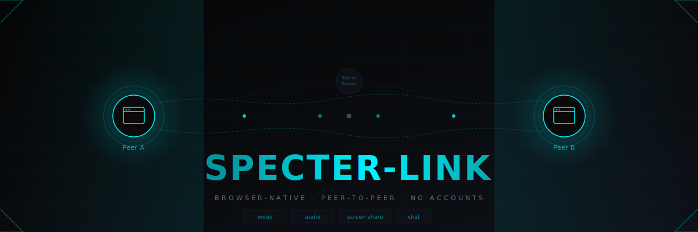

<p align="center">
  
</p>

# SPECTER-LINK

> Browser-native, peer-to-peer video / audio / screen-share and text chat.  
> No accounts. No server-side data storage. Direct WebRTC connections between peers.

---

## Prerequisites

- **Node.js 20+** — the signaling server uses the `peer` (v1) package which requires Node 18+.
- Two browsers (or two devices) that can reach each other's network.

---

## Quick start (local dev)

```bash
# 1. Install dependencies
npm install

# 2. Copy env file and adjust if needed
cp .env.example .env

# 3. Start both the PeerJS signaling server and Next.js dev server
npm run dev
```

`npm run dev` runs two processes concurrently:
- **Peer signaling server** on `http://localhost:9000/peerjs` (configurable via `.env`)
- **Next.js dev server** on `http://localhost:3000`

---

## How to test locally with two browser windows

1. Open `http://localhost:3000` in **Tab A**.
   - Wait for a Peer ID to appear (e.g. `abc-123-xyz`).
   - Click **Copy**.

2. Open `http://localhost:3000` in **Tab B** (or a different browser/private window).
   - Paste Tab A's Peer ID into the **Remote Peer ID** field.
   - Click **Join Room**.

3. Both tabs are now in the same room.
   - Use the toolbar to start an **Audio Call**, **Video Call**, or **Screen Share**.
   - Type in the chat box — messages are delivered in real time over the DataConnection.
   - Click **Leave Room** to disconnect and return to the lobby (your Peer ID is preserved).

> **Tip:** if `getUserMedia` is blocked, try opening the tabs in a private window where permissions reset cleanly, or serve over HTTPS.

---

## Separate scripts

| Command | Purpose |
|---------|---------|
| `npm run dev` | Peer server + Next.js (dev, concurrent) |
| `npm run build` | Build Next.js for production |
| `npm run start:server` | Peer signaling server only |
| `npm run start:next` | Next.js production server only |
| `npm run lint` | ESLint |
| `npm run typecheck` | TypeScript check (app + server configs) |
| `npm run test` | Jest test suite |
| `npm run test:watch` | Jest in watch mode |

---

## Architecture

```
Browser A  ──── DataConnection (text) ───────────────────────────  Browser B
           ──── MediaConnection (audio/video/screen) ─────────────

Both browsers connect to the PeerJS signaling server only to exchange
connection metadata (ICE candidates, SDP). Actual media and data travels
directly peer-to-peer via WebRTC.
```

### Signaling server (`server/peer-server.ts`)

- Built with **Express** + the official `peer` v2 package (`ExpressPeerServer`).
- Config via env vars: `PEERJS_PORT`, `PEERJS_PATH`.
- Exposes `GET /health → 200 { status: "ok" }`.
- Logs peer connect / disconnect events only — no message payloads are ever logged.

### Client (`hooks/usePeer.ts`)

- PeerJS is **dynamically imported** (`await import('peerjs')`) to avoid SSR issues.
- Both roles (host and guest) use the same hook — no mode flag required.
- `joinRoom(remoteId)` → guest dials the host by Peer ID.
- `startCall(type)` → acquires local media, calls the remote peer.
- `endCall()` → stops tracks and closes the MediaConnection; the DataConnection (chat) stays alive.
- `leaveRoom()` → closes everything and resets to lobby; the same Peer instance (and ID) persists.

---

## Privacy

- **No accounts, no sign-up.**
- Peer IDs are randomly generated on each page load by the PeerJS library.
- The signaling server only relays connection metadata — it never sees message content or media.
- All WebRTC connections are encrypted by the browser (DTLS-SRTP for media, SCTP/DTLS for data).
- Nothing is stored server-side beyond the in-memory peer-connection state during an active session.

---

## Deploying to production

The Next.js app can be hosted on **Vercel** or any static/serverless platform.

The **peer signaling server** must run on a long-lived server (VPS, container, etc.) that supports persistent TCP connections — serverless functions are not suitable.

```
# On your server:
npm run start:server

# Environment variables to set:
PEERJS_PORT=9000
PEERJS_PATH=/peerjs

# On Vercel (or wherever the Next.js app lives):
NEXT_PUBLIC_PEER_HOST=your-server.example.com
NEXT_PUBLIC_PEER_PORT=443       # use 443 if behind TLS termination
NEXT_PUBLIC_PEER_PATH=/peerjs
```

> When `NEXT_PUBLIC_PEER_HOST` is not `localhost` / `127.0.0.1`, the client automatically enables `secure: true` (WSS instead of WS).

For STUN/TURN beyond LAN: replace the default Google STUN servers in `hooks/usePeer.ts` → `iceServers` with your own or a commercial TURN provider if users are behind symmetric NATs.
